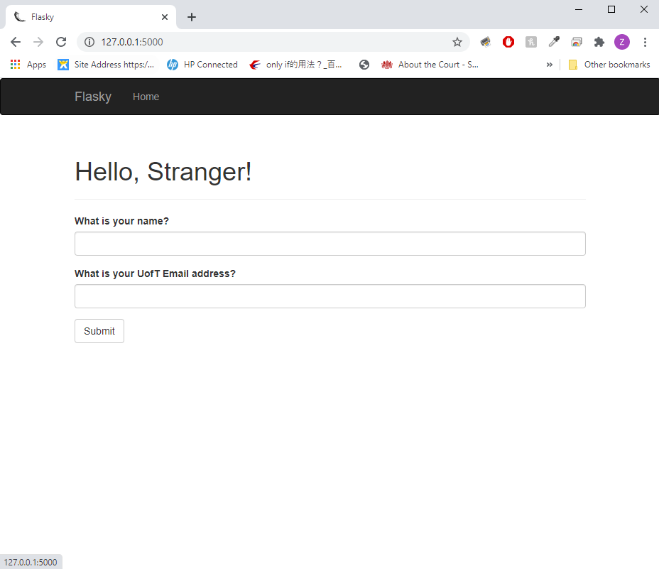
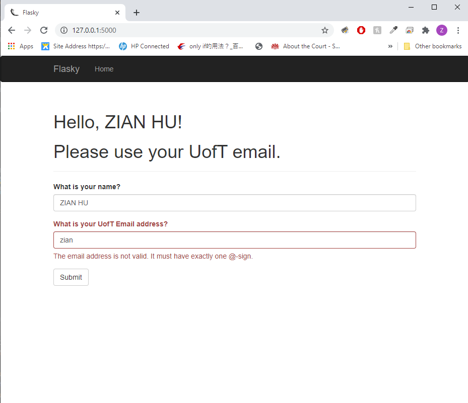
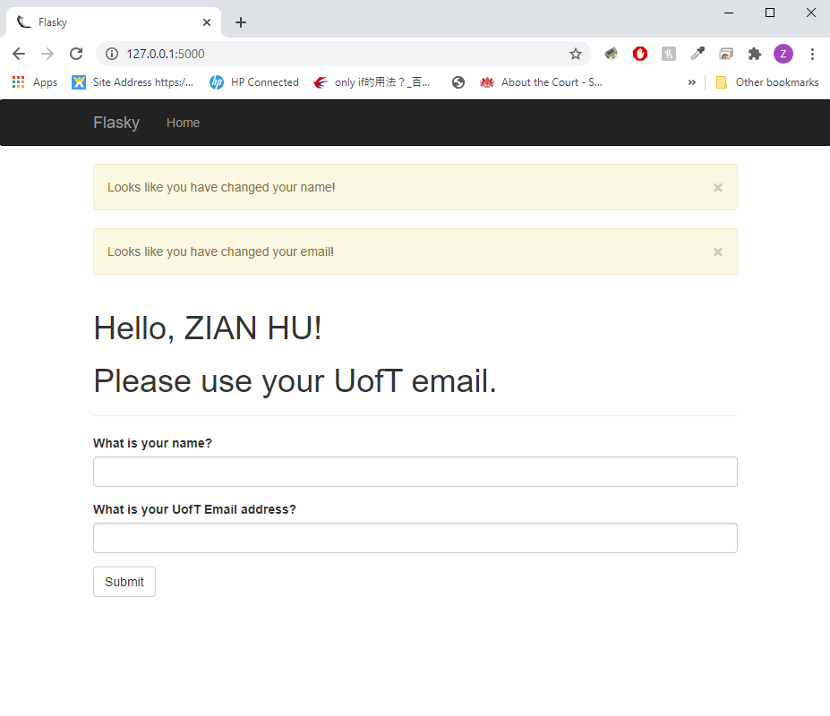

# ECE444-F2020-Lab3
Student Name: ZIAN HU

This repo is a clone of https://github.com/miguelgrinberg/flasky

## Activity 1: Replay and modify example in Chapter 3

  

## Activity 2: Replay and modify example in Chapter 4
Start screen:

  

First name & UofT email:

  

First and last name & First name:

  

First and last name & Non UofT email:

  

## Activity 3: Briefly summarize the difference between SQL or NoSQL database.
SQL databases are based on relational model and use structured query language. They store data 
in tables. Foreign keys can link data between rows, which in turn forms a relationship. The most
important advantage of SQL databases is that it allows data to be stored in a compact way by avoiding 
duplications. However, this also imposes a side effect as querying based on data from multiple tables
are more complicated.

NoSQL databases collectively refer to all databases that are not based on relational model.
These databases are mostly document-oriented and store information in key value pairs. They have
a reduced number of tables at the expense of data duplication. However, since all information about
an item is stored in the same document in NoSQL databases, this allows for faster querying.