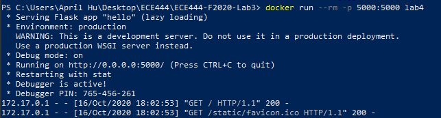
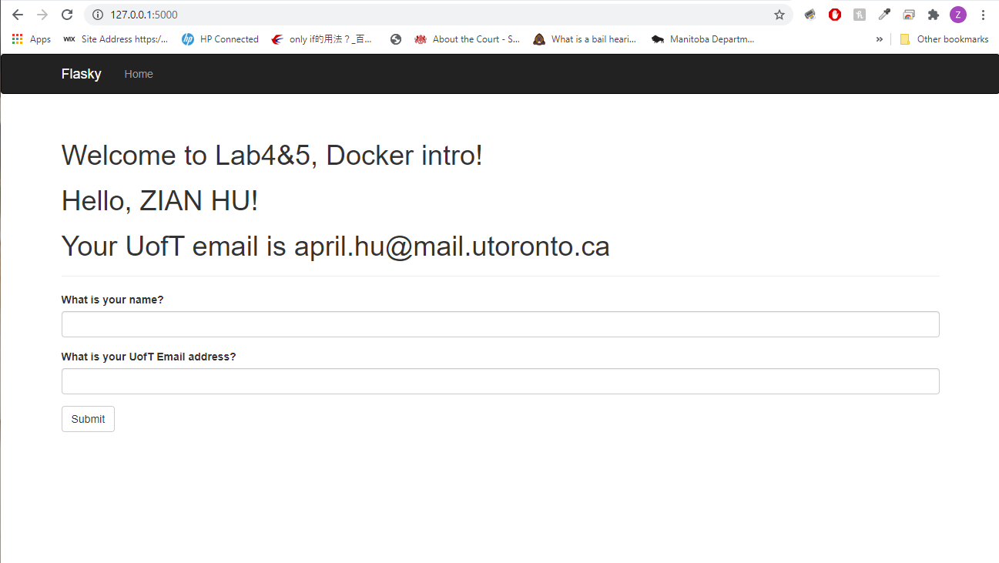
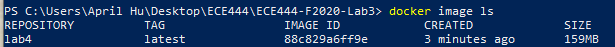

# ECE444-F2020-Lab4
Student Name: ZIAN HU

This repo is a clone of https://github.com/miguelgrinberg/flasky

## Build & Start
`Dockerfile` located in the root directory of this project.
To build the image, please make sure you are in the root directory of this project. Then run:

`docker build -t lab4:latest .`

To start a container, run:

`docker run --rm -p 5000:5000 lab4`

## Screenshots
Docker run command:

  

Browser:

  

Docker image:

  

## Briefly summarize the differences between Docker and Virtual Machine.
Docker is much more lightweight comparing with virtual machine. A docker container runs a discrete process and
shares host OS kernels with other containers. It is just like a process that is isolated from
other parts of the system, running from a Docker image that holds all files needed for this process. Also, memory-wise, 
docker container takes just the same amount of memory as any other executable. Docker containers virtualize OS.

On the other hand, a virtual machine is an emulation of a computer system. Each virtual machine runs its own underlying 
OS above the host OS, and the hardware is virtualized. It puts a lot more burden on RAM and CPU cycles of the host machine. 
However, comparing with Docker container, VMs are more isolated as it provides more than just process-level isolation. 
Hence, it could be more secure.